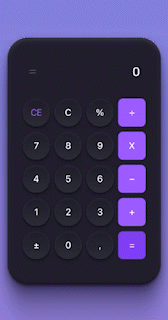

# Calculator with React/Typescript



Welcolme to the calculator app! This is a simple calculator app built with React and Typescript. The main objective of this project is to apply current knowledge in React and Typescript.

## Technologies used

[](https://www.typescriptlang.org/)
[](https://reactjs.org/)
[](https://vitejs.dev/)

## Deploy

The project is deployed on Vercel. You can access by clicking the button below:

[](https://vercel.com)

## How to run

First, clone the repository:

```bash
git clone https://github.com/pedrohenriquee8/calculator-app.git
```

Then, install the dependencies:

```bash
npm install
```

Finally, run the project:

```bash
npm run dev
```

## Credits

This project was based on the challenge proposed by [Rocketseat](https://www.github.com/rocketseat) through its [#boraCodar](https://boracodar.dev/) event.

## Final Considerations

It was extremely important to develop this project, considering that it was essential to apply current knowledge in the technologies used.

If you want to contribute to this project, feel free to submit a pull request with your suggestions!
